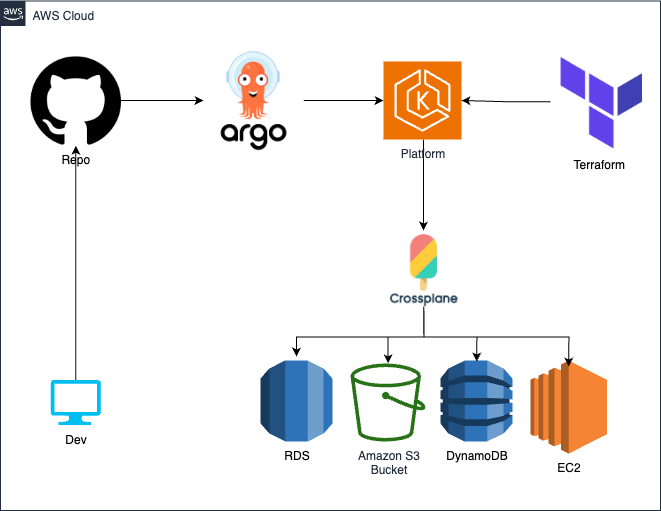

# EKS With Crossplane

This project sets up **Amazon EKS** with **Crossplane** and **ArgoCD** for **GitOps**.

ArgoCD uses this repository as the **Source of Truth (SoT)**, reconciling manifests into the EKS cluster. Crossplane uses **IRSA (IAM Roles for Service Accounts)** for secure AWS access.

## Architecture



## Setup Instructions

### 1. Networking

Create VPC, subnets, Internet Gateway, and NAT Gateway:

````bash
cd 01-networking
terraform init
terraform apply -auto-approve

### 3. ArgoCD Access

ArgoCD will deploy Crossplane manifests from `03-argocd/manifests`. An example is included for testing.

Retrieve the ArgoCD admin password:

```bash
cd 03-argocd/scripts
./loging-argocd.sh
````

## GitOps Workflow

1. Commit changes to manifests in `03-argocd/manifests`.
2. Push to Git.
3. ArgoCD detects changes and applies them to EKS.
4. Crossplane, using **IRSA**, provisions/updates AWS resources.

## Security

Crossplane uses **IRSA** for secure, credential-less access to AWS APIs, adhering to least privilege.

## Testing

Use the example in `03-argocd/manifests` to create a sample managed resource via Crossplane and observe its reconciliation in AWS.

```

```
